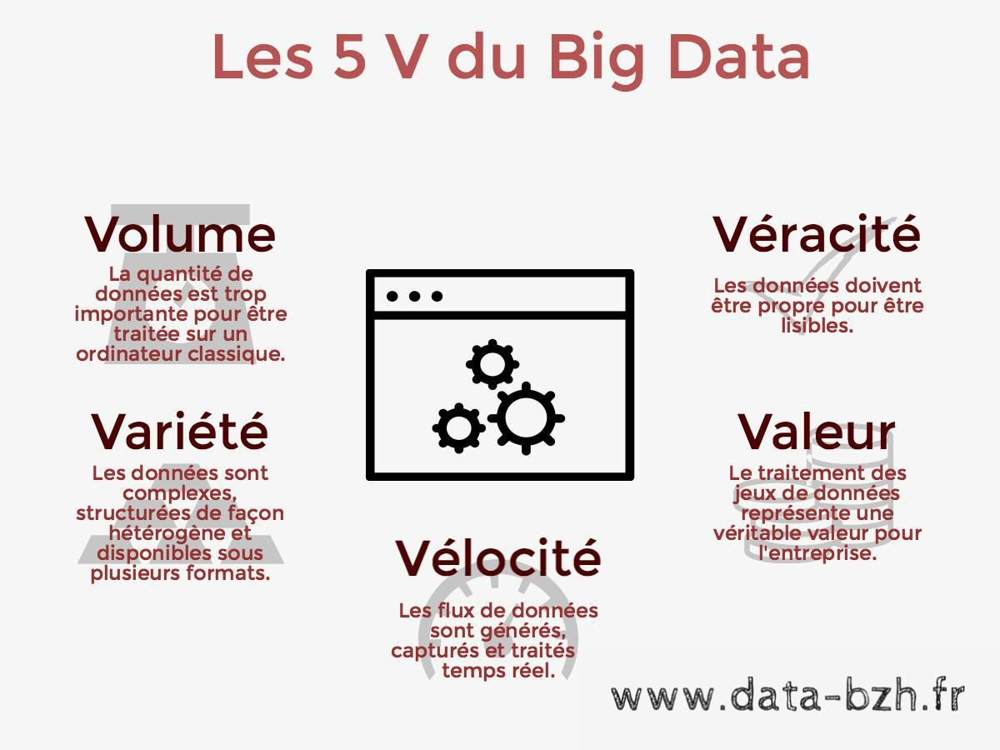
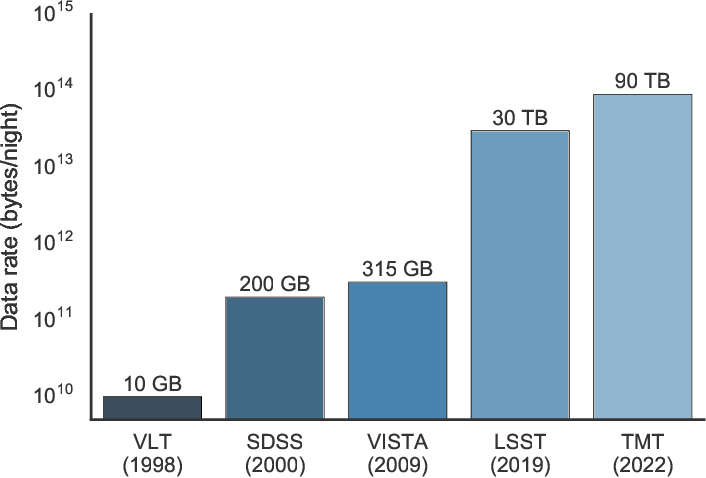

# Introduction:
Le big data est une science appliquée aux données largement utilisée de nos jours. L'astronomie est l'un des domaines où l'utilisation du big data est la plus répandue en raison de ses progrès actuels. Dans cette fiche de synthèse, le concept d'utilisation du big data et le domaine de l'astronomie, plus spécifiquement la radio-astronomie est discuté dans la section d'introduction. Les technologies adaptées en association avec le big data pour l'astronomie sont discutées dans les chapitres par la suite. Nous enchaînerons pour discuter la nature de la data rassembler pour des études en matière de l'astronomie. Par la fin, nous discuterons les applications du big data dans le domaine de l'astronomie telle que optimisation des algorithmes d'imagerie pour le traitement à grande échelle et traitement des données volumineuses sur FPGA.

## Big data analytics:

1. **C'est quoi le big data?** :

Le big data est un concept important appliqué aux données qui diffère de la structure typique d'une base de données traditionnelle. Avec les progrès récents des technologies qui permettent de capturer des données à grande vitesse, de les stocker et de les analyser, le concept de big data est devenu une méthodologie d'analyse des données. Il est impossible de donner une définition exacte du big data, car il s'agit d'une expression relativement nouvelle et évolutive. Le rapport Gartner mis en avant par Garter a défini le Big data avec les 3 V en 2001. Volume, vélocité et variété. La même définition a été élargie par Gartner en 2012 ; la véracité a été introduite. La véracité représente les exigences concernant la confiance et l'incertitude associées aux données à la suite de l'analyse des données. Pour faire comprendre que les applications Big data doivent apporter une valeur ajoutée aux entreprises, IDC a introduit en 2012 le cinquième V, la valeur. 

2. **L'analytique des données massives** :

Les données sont devenues trop volumineuses, trop peu structurées et trop rapides, ce qui rend les méthodes traditionnelles de traitement inefficaces. L'extraction d'informations à partir de grands ensembles de données est devenue extrêmement importante pour les business et les entreprises du monde entier. Ces données doivent être extraites efficacement ainsi que leurs sens , ce qui conduit à l'émergence de l'analyse des données volumineuses. Par conséquent, l'analytique est devenue fatalement importante pour saisir la valeur complète des Big data afin d'augmenter la qualité performances de travail dans un domaine d'étude. Par conséquent, les outils disponibles pour traiter le volume, la variété, la vélocité, la valeur et la véracité des données se sont grandement améliorés ces dernières années.

## Le big data dans l'astronimie:

L'astronomie est l'un des sujets les plus anciens auxquels les gens ont aimé s'adonner pendant des siècles. La contemplation du ciel la nuit a rendu les gens des civilisations de plus en plus curieux de la naissance, de l'existence et de la vie de l'univers dans lequel nous vivons. Par conséquent, ces personnes ont tendance à recueillir des données par l'observation et diverses expériences concernant l'univers, ce qui a rendu le domaine de l'astronomie riche en données. Depuis longtemps, l'astronomie acquiert, systématise et interprète de grandes quantités de données. Cette tradition se poursuit aujourd'hui, depuis les anciennes cartes du ciel jusqu'aux premières études photographiques du ciel datant du 20e siècle. 

**Données collectées par nuit de 1998-1999** : [Source](https://www.semanticscholar.org/paper/Big-Universe%2C-Big-Data%3A-Machine-Learning-and-Image-Kremer-Stensbo-Smidt/006b58e83db7575fcc2294fbef3f3d485ad158b8/figure/0)

Comme beaucoup d'autres domaines, l'astronomie est devenue un domaine très riche en données, grâce aux progrès des télescopes, de la technologie informatique et des détecteurs. Il existe déjà un certain nombre de grandes études du ciel et d'archives, contenant des téraoctets et des quantités d'informations encore plus importantes. La principale source de données astronomiques est l'observation du ciel de manière systématique sur un large éventail de longueurs d'onde. D'importants volumes d'informations sont également produits par un certain nombre de simulations. L'exploration de données a assuré l'efficacité et l'exhaustivité de l'utilisation scientifique de ces données, ce qui a conduit à un nouveau domaine de recherche en astronomie.

Il s'agit d'un grand changement par rapport au passé, où un seul objet ou un petit échantillon d'objets était utilisé pour être étudié individuellement, alors que l'univers entier peut être cartographié de manière systématique à l'heure actuelle. De l'obtention de données statistiques descriptives de notre galaxie et de la structure à grande échelle de l'univers à la découverte de types d'objets célestes peu communs, inhabituels ou même totalement nouveaux, une nouvelle science a émerger grâce à l'astronomie, tant sur le plan quantitatif que qualitatif.  Cette nouvelle astronomie liée au Big Data permettra d'aider les scientifiques et les étudiants à s'engager dans une astronomie riche en données sans avoir accès à de grands télescopes. Cela éclairera le domaine, car il permet l'accès à une quantité fascinante de données à une nouvelle collection de talents.

Les véritables découvertes scientifiques sont confrontées à un défi technique important lors de la manipulation et de l'exploration de ces grands volumes de données. Cet élargissement soudain des données liées à l'astronomie a rendu les données analytiques traditionnelles de l'astronomie inadéquates. Cependant, ces problèmes sont communs à presque tous les domaines riches en données. Et bien sûr, nous espérons que certaines idées et perspectives de ce travail affecteront et influenceront d'autres domaines de la science et de la technologie. Dans les ensembles de données astronomiques, la complexité et la taille des ensembles de données ne sont pas triviales mais peuvent être traitées.

