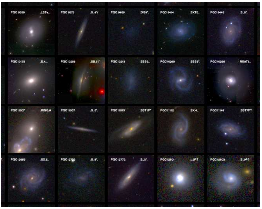
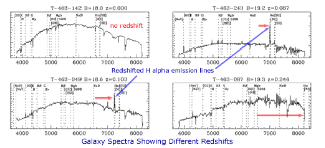
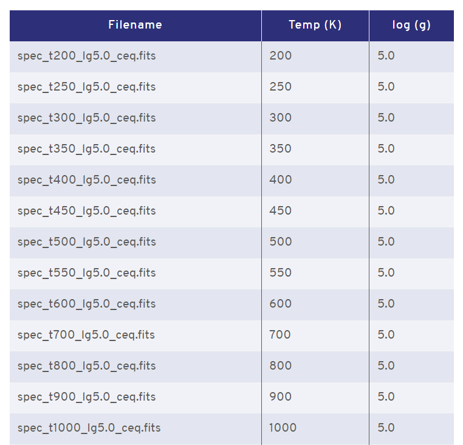

# 3- Types des données astronomiques 
Les données astronomiques se divisent en 4 catégories : 
## **Données de type images (Image Data)** : 
Ce sont les données les plus utilisées, d'une manière plus simple une image est un tableau de valeurs de pixels où chaque pixel présente la luminosité. 
Dans une image de couleurs ordinaires, chaque pixel a trois valeurs, indiquant la contribution des couleur Rouge, vert et Bleu (RGB).
Étant donné que les astronomes utilisent de nombreux filtres spécialisés au-delà de ces trois couleurs, les images astronomiques peuvent avoir encore plus de valeurs de 
couleur par pixel.
Les images astronomiques montrent généralement une région du ciel nocturne. On trouve plein d'exemple de ce type de données comme l'exemple qu'on peut visualiser dans l'image suivante.

**Extrait d'une chantillon d'images de galaxies bien resolues aux longueurs d'ondes visibles** : [Source](https://core.ac.uk/reader/15495260).

## **Données de spectres (Spectra)** :
Des spectres simples nous montrent la façon dont l'énergie de la lumière émise par un objet se répartit entre les différentes longueurs d'onde possibles. Ces spectres simples sont unidimensionnels : pour chaque valeur de longueur d'onde, nous connaissons la contribution de la lumière de cette région de longueur d'onde particulière.

**Exemple de données de spectres d'une galaxie** : [Source](https://www.atnf.csiro.au/outreach/education/senior/astrophysics/spectra_astro_types.html)

## **Données cubique (Data Cube)**:
On pourrait cosidérer ce type de données comme étant une version améliorée des images astronomiques. Un exemple est un cube de données de ce qu'on appelle la spectroscopie intégrale de champ (IFS) ; un tel cube de données est comme une image bidimensionnelle, mais maintenant chaque pixel ne contient pas une valeur de luminosité, mais un spectre entier reçu de la région du ciel à l'intérieur de ce pixel. Puisque nous avons un spectre unidimensionnel pour chaque pixel d'une image bidimensionnelle, cela nous donne en fait un objet tridimensionnel : un cube de données.

## **Données de catalaogue (Catalog Data)**:
A un niveau d'analyse supérieur, les astronomes dressent des catalogues des propriétés des différents types d'objets astronomiques. Un catalogue d'étoiles, par exemple, pourrait répertorier la position, le mouvement propre, la parallaxe, la luminosité (dans diverses bandes de longueur d'onde) et la température effective pour chacune d'une sélection spécifique d'étoiles. On trouve aussi un catalogue des planètes, des atroides...tel que chaque groupe est caractérisé par sa propre morphologie.

**Exemple de données de type catalogue d'une étoile** : [Source](https://www.stsci.edu/hst/instrumentation/reference-data-for-calibration-and-tools/astronomical-catalogs/atmo-2020-atmosphere-models)
