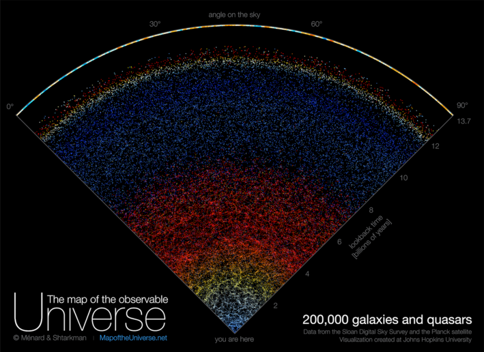
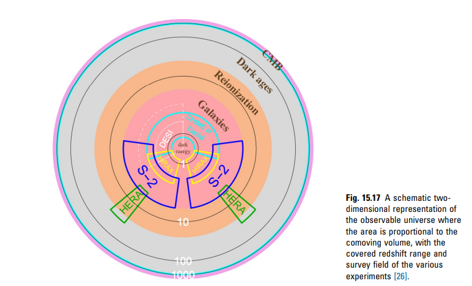

# 5- Une Carte de l'Univers

L'onde d'hydrogène à longueur d'onde de 21 cm offre une sonde d'observation qui couvre la majeure partie du volume cosmique observable, de l'âge sombre à l'univers moderne. l'univers moderne. Actuellement, un certain nombre d'expériences sont en cours ou prévues pour mesurer le signal cosmologique à 21 cm à différents décalages vers le rouge. 

Les expériences à faible et moyen décalage vers le rouge sont principalement conçues pour cartographier la structure à grande échelle et mesurer les caractéristiques de l'oscillation acoustique des baryons afin de sonder l'équation d'état de l'énergie noire. Les expériences existantes à 21 cm, telles que Tianlai, CHIME, HIRAX, et l'étude de cartographie d'intensité de SKA-mid, sont principalement dédiées aux faibles décalages vers le rouge. Il a été proposé qu'une expérience de stade 2 puisse cartographier l'univers de postréionisation à faible/moyen décalage vers le rouge. Les expériences à plus haut redshift plus élevés, tels que LOFAR, MWA, HERA et le futur SKA-low, s'intéressent à l'époque de la réionisation et aux aubes cosmiques.

Des idées ont également été avancées pour aller au-delà de l'aube cosmique, vers l'âge sombre du cosmos. En raison des limites de l'ionosphère terrestre, ces expériences devront peut-être être menées depuis la face cachée de la Lune. S'ils sont pleinement explorés, les modes de Fourier qui peuvent être mesurés avec la ligne de 21 cm sont environ 106 de ceux du CMB. Elle contient donc la plus grande quantité d'informations connues sur les fluctuations primordiales, que nous pouvons utiliser pour sonder l'origine cosmique. Cependant, à mesure que l'avant-plan synchrotron s'étend, l'avant-plan est plus fort aux basses fréquences, il est donc aussi de plus en plus difficile d'effectuer la mesure aux décalages vers le rouge les plus élevés. Il faut donc des réseaux de plus en plus grands pour satisfaire aux exigences de base en matière de sensibilité. 

L'expérience réelle à 21 cm doit également faire face à de nombreuses complications, notamment la réponse compliquée du télescope et la contamination des divers avant-plans. Néanmoins, avec l'augmentation de la sensibilité et l'accroissement des capacités de calcul, ces problèmes seront surmontés, et nous pensons que la cosmologie à 21 cm arrivera à maturité au cours de la prochaine décennie.